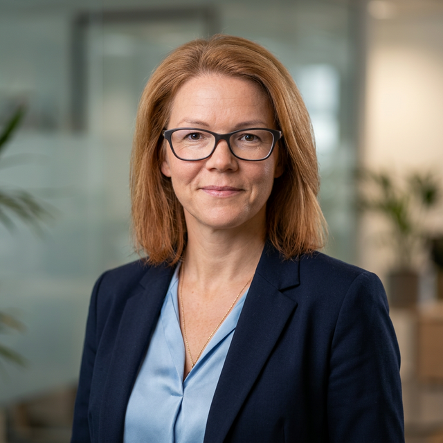

# SANDA VEISA

**Full-Stack Web Developer & UI/UX Architect**

*Experienced in building high-end, conversion-driven web applications and scalable enterprise systems using modern JavaScript frameworks (Next.js/React) and headless architectures. Specialized in AI integration, multilingual digital products, and performant headless CMS solutions.*

**📍 Location:** Spain / Fully Remote
**🔗 Portfolio:** [www.sandaveisa.com](https://www.sandaveisa.com) (Balearic Yacht Charters, Moonlit Keen, Portmanns & Co)
**✉️ Email:** sanda.veisa@gmail.com
**📱 Phone:** +371 29488921
**💼 LinkedIn:** [linkedin.com/in/sanda-veisa-60148a3ab](https://www.linkedin.com/in/sanda-veisa-60148a3ab)
**💻 GitHub:** github.com/sandaveisa-cloud

---

## 🛠 CORE COMPETENCIES & TECH STACK

**Frontend Development:** Next.js 15 (App Router), React.js, TypeScript, Tailwind CSS, Framer Motion (Advanced Animations)
**Backend & Database:** Supabase (PostgreSQL, Auth, Storage), API Development, Server Actions, PHP
**AI & Automations:** Google Gemini 1.5/3.1 API, Anthropic Claude, Google NotebookLM (Data Synthesis), Generative UI, Custom Prompt Engineering, Webhook integrations
**Architecture & CMS:** Headless UI, Custom WordPress Theme Development (Advanced Custom Fields Pro, WooCommerce, Polylang), next-intl (i18n Multi-language routing)
**Marketing & Media:** Full Website & Digital Marketing Audits, DaVinci Resolve, Wondershare Filmora, CapCut (High-conversion ad creation)
**DevOps & Tools:** Git (Advanced Version Control), GitHub, Vercel Edge Deployment, CI/CD, Figma (UI/UX Design), LocalWP

---

## 💼 PROFESSIONAL EXPERIENCE

**Lead Web Developer & Architect | Freelance / Self-Employed**
*2022 – Present*
Leading end-to-end development of premium digital products for international B2B and B2C clients, focusing on absolute performance, security, and elite user experiences. Complete lifecycle management from UX prototyping to Vercel/Cloud deployment.

**Key Achievements & Responsibilities:**
- **AI Marketing Dashboard Development:** Engineered a bespoke Next.js `/admin` terminal integrated with Google Gemini Flash and Pollinations AI for automated, photorealistic social media asset generation across 4 languages (EN, LV, DE, RU), cutting marketing workload by 80%.
- **B2B Infrastructure Modernization:** Built complete digital overhauls for legacy systems (e.g., SIA Portmanns & Co logistics), implementing complex Conditional Logic forms (Zod + React Hook Form) and dynamic ADR (Dangerous Goods) rate calculators.
- **E-Commerce Innovation:** Built a custom React-based "Cake Builder v2.0" module for a bespoke bakery (Gardais Kumoss) that processes multivariable user inputs and directly syncs metadata with WhatsApp ordering APIs.
- **Multilingual Scaling:** Specialized in global edge-ready apps using `next-intl` and Supabase JSONB architectures for seamless layout-shifting and real-time content translation.

---

## 🚀 FEATURED PROJECTS

### Balearic Yacht Charter (High-End SaaS Platform)
*Tech Stack: Next.js 15, Supabase, Tailwind CSS, Vercel, Generative AI*
- Developed a high-end luxury yacht booking platform from scratch.
- Integrated a fully relational Supabase database architecture for dynamic Mediterranean itineraries and complex vessel specifications.
- Crafted a purely custom Admin Navigation portal for the client to oversee milestones, media optimization, and AI-driven "Experiential Luxury" copy generation.

### SIA Portmanns & Co (B2B Logistics Web Application)
*Tech Stack: Next.js 15 (App Router), TypeScript, next-intl, Framer Motion*
- Transformed an outdated business site into a high-conversion sales tool operating flawlessly in 4 languages.
- Implemented Google Maps Places API for precision routing in Quote requests.
- Created an interactive "Driver Onboarding" mobile-first portal to streamline logistics HR processes.

### Moonlit Keen Design (Premium Service Portal)
*Tech Stack: Next.js, Framer Motion, Stripe, Calendly*
- Delivered a luxury slow-living interior design web experience characterized by immersive 4K video backgrounds and sophisticated delayed typographic reveals.
- Integrated Stripe for digital product sales and Calendly for automated consulting bookings.

### Gardais Kumoss (Bespoke WordPress E-Commerce)
*Tech Stack: Custom PHP Theme, WooCommerce, React, ACF Pro*
*Portfolio URL (In Transition): gardaiskumoss.co.uk*
- Built a deeply customized, zero-bloat WordPress theme avoiding heavy page builders. Set up automated multilingual scaling (LV/EN) using lightweight, centralized dictionary functions.

---

## 🎓 EDUCATION & CONTINUOUS LEARNING

**Law College of Latvia**
*Diploma / Foundational Education*
- Academic background providing strong analytical, logical reasoning, and contract management skills applied in modern business logic and logic-heavy development tasks.

**Self-Taught Full-Stack Engineer & Lifelong Learner**
*Autodidact / Intensive Project-Based Learning*
- Mastered advanced web development, full-stack frameworks (React/Next.js), and AI integrations entirely through rigorous self-guided study and continuous practical implementation on commercial, high-end projects.

**Relevant High-Level Masterclasses & Certifications:**
- **Next.js 15 & React Advanced Architecture Masterclass** *(Server Components, Vercel Edge, Caching)*
- **Generative AI & LLM Integration Workshops** *(Google Gemini, Claude, Prompt Engineering)*
- **Modern Database & Backend Architecture** *(Supabase, PostgreSQL Relational Data Modeling)*
- **UI/UX & Advanced Animation Dynamics** *(Framer Motion, Clean Code Interface Design)*
- **Custom WordPress Theme Engineering** *(Zero-bloat architecture, PHP, ACF Pro)*

---

## 🌐 LANGUAGES
- **Latvian:** Native
- **English:** Full Professional Proficiency
- **Russian:** Conversational / Technical Reading
- **German:** Technical functional (Implementing via i18n routing)
- **Spanish:** Currently undertaking intensive language courses (Living & integrated in Spain)

---
*I am actively looking for mid/senior-level Frontend or Full-Stack Next.js roles in product-focused companies that value robust engineering, clean code architecture, and high UI/UX polish.*
